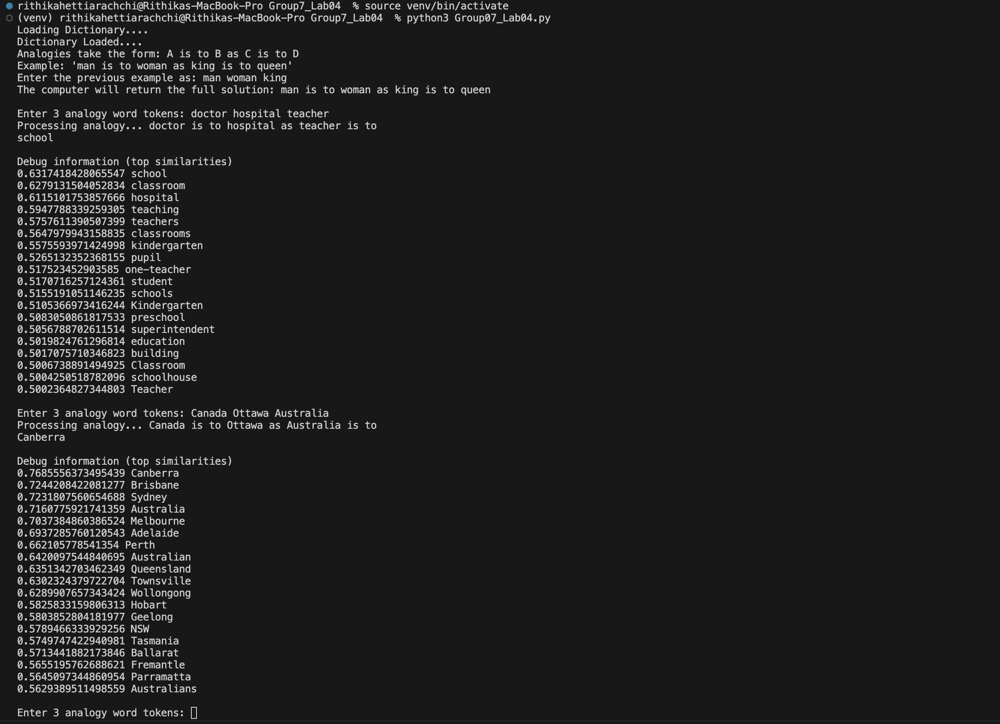

# Word Analogy Processor

This project is designed to process word analogies using pre-trained word vectors. Analogies are processed in the form "A is to B as C is to D". The script calculates the most suitable word D given the words A, B, and C.

## Requirements

- Python 3.x
- NumPy library

## Files

- `Group7_Lab04.py`: The main script containing the functions and execution logic.
- `wiki-news-300d-1M.vec`: The input file containing pre-trained word vectors. This file should be in the same directory as `main.py`.

## Global Variables

- `words`: A list that stores words from the input file.
- `vectors`: A NumPy array that stores the corresponding vectors for the words.
- `matches`: A list used to store the best matches based on cosine similarity.
- `word_count`: The total number of words.
- `dim_count`: The dimensionality of the vectors.

## Functions

### `load_word_vectors(input_file)`

Loads the word list and set of vectors from the input file.

- **Parameters:**
  - `input_file`: Path to the file containing the word vectors.

### `get_vect(word)`

Retrieves the 300-dimensional vector for the given word.

- **Parameters:**
  - `word`: The word to retrieve the vector for.
- **Returns:**
  - A 300-dimensional NumPy array if the word is found, `None` otherwise.

### `add_vect(vec1, vec2, op)`

Adds or subtracts two vectors based on the operation specified.

- **Parameters:**
  - `vec1`: The first vector.
  - `vec2`: The second vector.
  - `op`: The operation to perform (1 for addition, -1 for subtraction).
- **Returns:**
  - The resulting vector after the operation.

### `match_vect(x, cos_sim)`

Updates the `matches` array based on the cosine similarity result.

- **Parameters:**
  - `x`: The index of the word in the `words` list.
  - `cos_sim`: The cosine similarity value.

### `calculate_cosine_similarity(vecA, vecB)`

Calculates the cosine similarity between two vectors.

- **Parameters:**
  - `vecA`: The first vector.
  - `vecB`: The second vector.
- **Returns:**
  - The cosine similarity between the two vectors.

### `find_analogies()`

The main function to process analogies entered by the user.

- Prompts the user to enter three words in the form "A B C".
- Computes the word D such that "A is to B as C is to D".
- Prints the result and additional debug information.

## Usage

1. Ensure that `wiki-news-300d-1M.vec` is in the same directory as `main.py`.
2. Run the script:
   ```bash
   python Group07_Lab04.py
   ```
3. Follow the prompts to enter word analogies in the form "A B C".
4. The script will output the most suitable word D and provide debug information.

## Output


